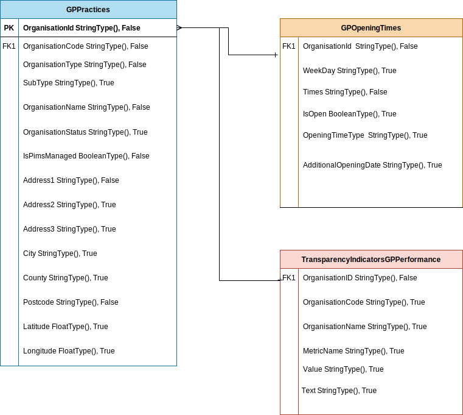

# Logical Data Model

## Introduction

The data model consist of information for GP Practices: location, performance and opening times. 
Data model done for datalake using pyspark

## Data model

### GPPractices

```
schema = StructType([
    StructField("OrganisationID", StringType(), False),
    StructField("OrganisationCode", StringType(), False),
    StructField("OrganisationType", StringType(), False),
    StructField("SubType", StringType(), True),
    StructField("OrganisationName", StringType(), False),
    StructField("OrganisationStatus", StringType(), True),
    StructField("IsPimsManaged", BooleanType(), False),
    StructField("Address1", StringType(), False),
    StructField("Address2", StringType(), True),
    StructField("Address3", StringType(), True),
    StructField("City", StringType(), True),
    StructField("County", StringType(), True),
    StructField("Postcode", StringType(), False),
    StructField("Latitude", FloatType(), True),
    StructField("Longitude", FloatType(), True)
])


```
### GPOpeningTimes

```
schema = StructType([
    StructField("OrganisationID", StringType(), False),
    StructField("Times", StringType(), False),
    StructField("IsOpen", BooleanType(), True),
    StructField("OpeningTimeType", StringType(), True),
    StructField("AdditionalOpeningDate", StringType(), True)
])

```
### TransparencyIndicatorsGPPerformance

```
schema = StructType([
    StructField("OrganisationID", StringType(), False),
    StructField("OrganisationCode", StringType(), True),
    StructField("OrganisationName", StringType(), True),
    StructField("MetricName", StringType(), True),
    StructField("Value", StringType(), True),
    StructField("Text", StringType(), True)
])

```





# Data load and transform


```
./src/load_transform.py
```
